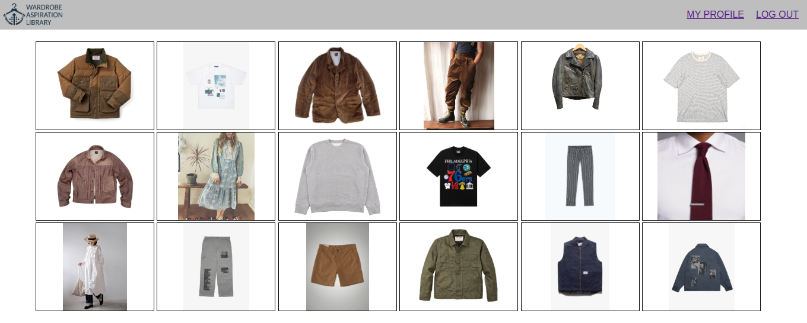
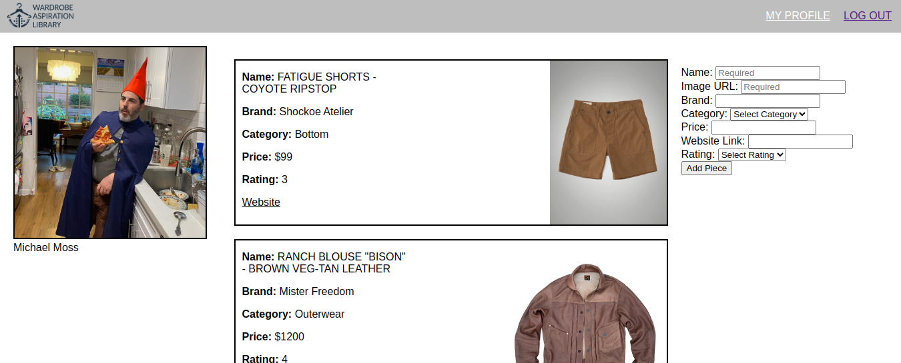
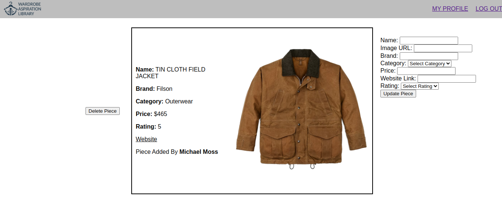

# Wardrobe Aspiration Library
With Wardrobe Aspiration Library (WAL) users have a digital repository for the attire they aspire to. Once users have created a profile, they can add images and information about cool gear from brand websites, clothing retailers and e-commerce platforms like Etsy and Ebay. WAL allows users to share their unique style, explore the fashion choices of others, discover stylish clothing items, and express themselves creatively. Visiting a user's WAL is an excellent idea when searching for a gift they'll truly appreciate!

# Technologies Used

- Express.js
- Mongodb
- Mongoose
- JavaScript
- HTML
- CSS
- git
- Google Oauth

# Screenshots

#

#

#

# Next Steps

- WAL was made in a hurry so it could use a refactor and tidying up.
- I learned so much while creating WAL that my techniques changed and improved. As a result identical taks are accomplished in different ways across the application. The application should be refactored to apply best practices throughout.
- Many additional features could be added
    - The ability to browse all pieces
    - The ability to search pieces and users
    - Messaging between users
    - The ability for users to provide additional information on their profile like their clothing sizes
    - Quick add functionality to streamline the adding of pieces
    - A browser extension and or integration with retailers to allow users quick add pieces to their collection

# Link

[Click to visit Wardrobe Aspiration Library](your deployment url here)